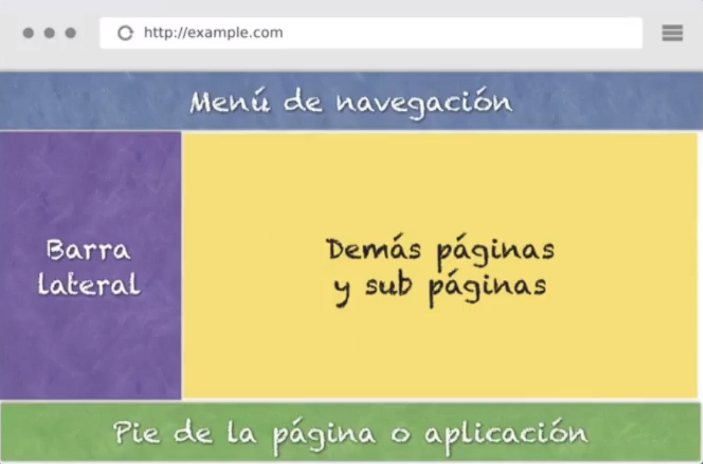
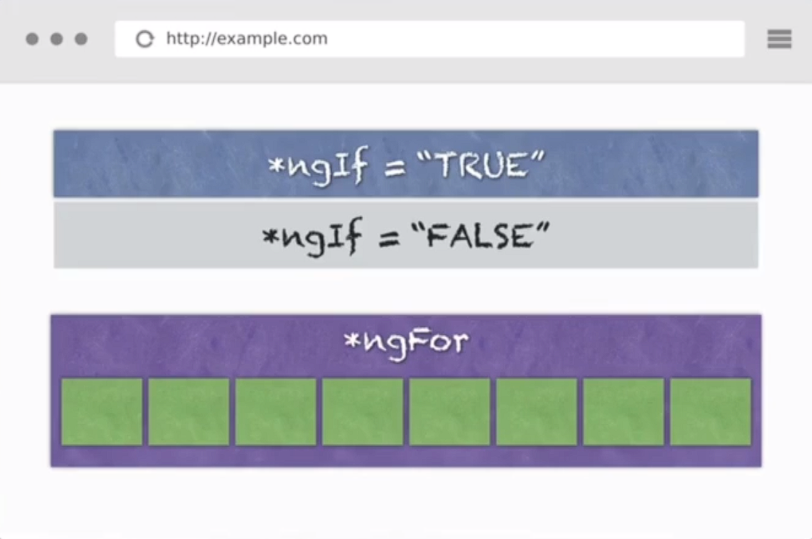
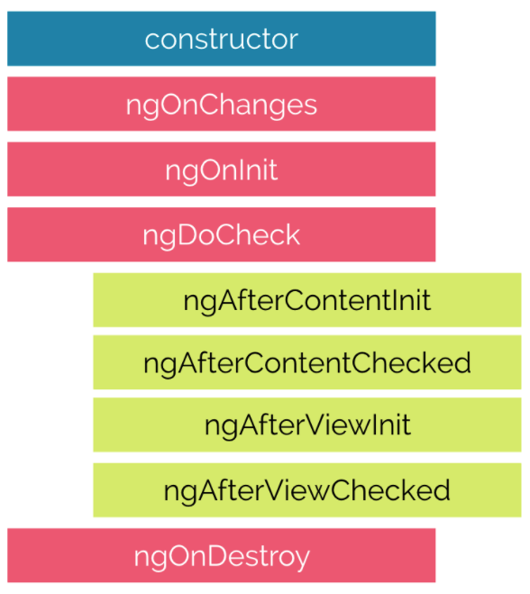
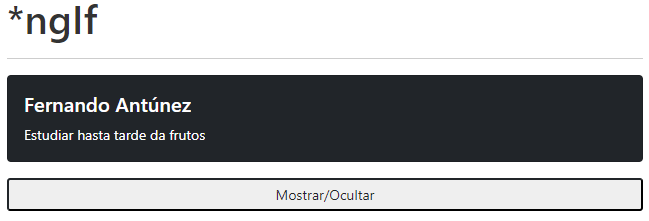
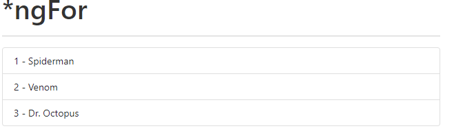

# Curso Base de Angular

* [Proyecto de Angular](#proyecto-de-angular)
* [Combados básicos](#combados-básicos)
* [Estructura de un proyecto de Angular](#estructura-de-un-proyecto-de-angular)
* [Componentes](#componentes)
  * [ngOnChanges](#ngonchanges)
  * [ngOnInit](#ngoninit)
  * [ngDoCheck](#ngdocheck)
  * [ngAfterContentInit](#ngaftercontentinit)
  * [ngAfterContentChecked](#ngaftercontentchecked)
  * [ngAfterViewInit](#ngafterviewinit)
  * [ngAfterViewChecked](#ngafterviewchecked)
  * [ngOnDestroy](#ngondestroy)
* [Servicios](#servicios)
* [Directivas](#directivas)
* [Módulo](#módulo)
* [CommonModule](#commonmodule)
  * [ngIf](#ngif)
  * [ngFor](#ngfor)
  * [ngStyle](#ngstyle)
  * [ngClass](#ngclass)
  * [ngSwitch](#ngSwitch)
* [Bootstrap](#bootstrap)
* [Navegación en Angular](#navegación-en-angular)
  * [Routes File](#routes-file)
  * [RouterLink y RouterLinkActive](#routerlink-y-routerlinkactive)
  * [Router](#router)
  * [ActivatedRoute](#activatedroute)  
  * [Rutas Anidadas](#rutas-anidadas)  
* [Decoradores](#decoradores)
  * [@Input](#input)
  * [@Output](#output)
* [Guard](#guard)
* [Pipes](#pipes)
  * [Uppercase](#uppercase)
  * [Lowercase](#lowercase)
  * [Slice](#slice)
  * [Decimal](#decimal)
  * [Percent](#percent)
  * [Currency](#currency)
  * [Json](#json)
  * [Async](#async)
  * [Date](#date)  
  * [Personalizado](#personalizado)  
  * [DomSeguro](#domseguro)  
* [Peticiones HTTP](#peticiones-http)
* [RxJS](#rxjs)
  * [Pipe()](#pipe)
  * [Map()](#map)
  * [Suscribe()](#suscribe)   
  * [Operadores RxJs vs Función de Orden Superior](#operadores-rxjs-vs-función-de-orden-superior)
* [Storage](#storage)
  * [Local Storage](#local-storage)
  * [Session Storage](#session-storage)
* [Template Forms](#template-forms)
* [Reactive Forms](#reactive-forms)
* [Angular Material](#angular-material)
  * [Instalación y Configuración](#instalación-y-configuración)


 
## Proyecto de Angular
Angular es un lenguaje basado en `componentes`, por lo general una app de angular se basa en múltiples componentes, como pudiesen ser el menú de navegación, barra lateral, páginas y subpáginas, pie de páginas, etc.



Las `directivas estructurales` son instrucciones que le indicarán a la sección de HTML que hacer, por ejemplo `*ngIf`, `*ngFor`


## Combados básicos
*   **`ng new app-name`:** Permite la creación de un nuevo proyecto de Angular bajo el nombre `app-name` y parámetros indicados
*   **`ng serve`:** Permite instanciar el proyecto de angular en el puerto establecido por defecto levanta en el `4200`. 
    * Usamos la bandera **`-p`** para indicar el puerto donde deseamos que abra `ng serve -p 4201`.
    * Usamos la bandera **`-o`** para indicar que una vez que cargue, abra el navegador por defecto `ng serve -o`.
*   **`ng generate component ruta`:** Crea un nuevo componente en nuestro proyecto de angular en la ruta indicada, por default lo cera en la carpeta `app`, podemos abreviar la petición `ng g c components/footer`, Este comando creará el componente en la ruta `src/app/components/footer/footer.component.ts`.
    * Usamos la bandera **`-s`**`(--inline-style)` para generar componentes sin el archivo de estilos.
    * Usamos la bandera **`-t`**`(--inline-template)` para generar componentes sin la plantilla HTML en el component.ts.
    * Usamos la bandera **`--skip-tests`** para generar componentes sin el archivo `.spec`.
    * Usamos la bandera **`--flat`** para generar componentes en la ruta principal o en una especifica sin crear una carpeta que haga alusión al nombre del mismo.
*   **`ng generate service ruta`:** Crea un servicio en la ruta indicada, por default lo crea en la carpeta `app`, podemos abreviar la petición `ng g s services/spotify`, Este comando creará el servicio en la ruta `src/app/services/spotify.service.ts`.
    * Usamos la bandera **`--skip-tests`** para generar el servicio sin el archivo `.spec`.
*   **`ng generate directive ruta`:** Crea una directiva personalizada en la ruta indicada, por default lo crea en la carpeta `app`, podemos abreviar la petición `ng g d directives/resaltado`, Este comando creará la directiva en la ruta `src/app/directives/resaltado/resaltado.directive.ts`.
    * Usamos la bandera **`--skip-tests`** para generar la directiva sin el archivo `.spec`.
*   **`ng generate pipe ruta`:** Crea un pipe personalizado en la ruta indicada, por default lo crea en la carpeta `app`, podemos abreviar la petición `ng g p pipes/capitalizado`, Este comando creará el pipe en la ruta `src/app/pipes/capitalizado/capitalizado.pipe.ts`.
*   **`ng generate guard ruta`:** Crea un guard en la ruta indicada, por default lo crea en la carpeta `app`, podemos abreviar la petición `ng g guard guards/auth`, Este comando creará la directiva en la ruta `src/app/guards/guard/auth.guard.ts`.
    * Usamos la bandera **`--skip-tests`** para generar el guard sin el archivo `.spec`.


## Estructura de un proyecto de Angular
```sh
├── e2e                    //Carpeta destinada a la realización de pruebas unitarias y de integración.
├── node_modules           //Carpeta destinada a los módulos de node.
├── src                    //Carpeta donde se guardara el source code del api
│   ├── app                //Carpeta estandar con la primera APP de angular.
│   │   ├── components     //Carpeta que contendrá los componentes a crear.
│   │   ├── directives     //Carpeta que contendrá las directivas a crear.
│   │   ├── guards         //Carpeta que contendrá los guards a crear.
│   │   ├── pipes          //Carpeta que contendrá los pipes a crear.
│   │   ├── services       //Carpeta que contendrá los servicios a crear.
│   │   ├── app.component.css      //Archivo de estilos del componente app.
│   │   ├── app.component.html     //Archivo html del componente app.
│   │   ├── app.component.spec.ts  //Archivo de pruebas automáticas del componente app
│   │   ├── app.component.ts       //Archivo de typescript del componente app
│   │   ├── app.module.ts          //Archivo de módulos del componente app
│   ├── assets             //Carpeta que contiene recursos estáticos (imágenes/librerías externas). 
│   │   ├── .gitkeep       //Archivo para mantener la carpeta al subir a un repositorio.
│   ├── environments       //Carpeta que contiene los ambientes de la APP. 
│   │   ├── environment.prod.ts    //Archivo con ambiente de producción.
│   │   ├── environment.ts         //Archivo con ambiente de desarrollo.
│   ├── favicon.ico        //Icono que representa la página en las pestañas.
│   ├── index.html         //Página web inicial que renderizar
│   ├── main.ts            //Archivo con el primer código a usar para lanzar la APP
│   ├── polyfills.ts       //Archivo que ayuda a la compatibilidad entre versiones viejas de navegadores
│   ├── styles.css         //Archivo para manejar los estilos globales de la APP
│   └── test.ts            //Archivo que contiene todas las rutas de los servicios desarrollados.
├── karma.conf.js          //Archivo de configuración de las pruebas de Karma.
├── .editconfig            //Archivo de configuraciones propías del editor.
├── .gitignore             //Archivo que permitirá que el repositorio de git ignore todos los archivos detallados en él
├── angular.json           //Archivo que permite indicarle a Angular el funcionamiento de la APP.
├── package.json           //Archivo donde se ven los paquetes o dependencias instaladas en el proyecto.
├── package-lock.json      //Archivo que deja un rastro de como fue creado el package.json
├── tsconfig.json          //Archivo que indicar los estándares de typescript a usar
├── tslint.json            //Archivo que vigila como escribimos nuestro código, en base a las reglas que especificamos
├── tsconfig.app.json      //Archivo con configuraciones propias de typescript para la APP
├── tsconfig.spec.json     //Archivo con configuraciones propias para las pruebas de  typescript en la APP
└── README.md              //Información general del proyecto
```

## Componentes
Los `componentes` son clases con bloques de código re-utilizable que poseen un decorador específico y ejecután una acción en particular, consta básicamente de:
* **`Component.css`**: Archivo de estilos del componente app.
* **`Component.html`**: Archivo html del componente app.
* **`Component.spec.ts`**: Archivo de pruebas automáticas del componente app
* **`Component.ts`**: Archivo de typescript del componente app, incluirá:
  *   **`@Component`:** Decorador base de Angular que proporcionará datos de configuración a fin de indicar como procesar, instanciar y usar el componente en tiempo de ejecución.
  *   **`selector`:** Le indicará a Angular que cuando sea escogido deberá renderizar el `templateUrl`
  *   **`templateUrl`:** Ruta donde se encontrará la plantilla a renderizar
  *   **`styleUrls`:** Ruta del archivo estilo a aplicar (CSS, SASS, etc), unicamente al componente creado 

  ```ts
  import { Component } from '@angular/core';

  @Component({
    selector: 'app-header',
    templateUrl: './header.component.html',
    styleUrls: ['./header.component.css']
  })
  export class HeaderComponent {
  }
  ```

Para indicarle a angular que el componente creado es uno el cual puede utilizar basta con dirigirse al `app.module.ts`, importar la ruta del nuevo componente creado y declararlo en la sección `declarations`

```ts
import { BrowserModule } from '@angular/platform-browser';
import { NgModule } from '@angular/core';

import { AppComponent } from './app.component';
import { HeaderComponent } from './components/header/header.component'

@NgModule({
  declarations: [
    AppComponent,
    HeaderComponent
  ],
  imports: [
    BrowserModule
  ],
  providers: [],
  bootstrap: [AppComponent]
})
export class AppModule { }
```

El ciclo de vida de un componente o `lifecycle hook` esta compuesto por 8 etapas denominadas `lifecycle hook event` o `evento de enlace de ciclo de vida`




#### ngOnChanges
Este evento se ejecuta cada vez que se cambia un valor de un input control dentro de un componente. Se activa primero cuando se cambia el valor de una propiedad vinculada. Siempre recibe un change data map o mapa de datos de cambio, que contiene el valor actual y anterior de la propiedad vinculada envuelta en un SimpleChange
```ts
import { Component, OnChanges } from '@angular/core';

@Component({
  selector: 'app-home',
  template: `
    <app-ng-style></app-ng-style>`,
  styles: [
  ]
})
export class HomeComponent implements OnChanges {

  constructor() {}

ngOnChanges(){
  console.log("ngOnChanges");
}
```

#### ngOnInit
Se ejecuta una vez que Angular ha desplegado los data-bound properties(variables vinculadas a datos) o cuando el componente ha sido inicializado, una vez que ngOnChanges se haya ejecutado. Este evento es utilizado principalmente para inicializar la data en el componente.
```ts
import { Component, OnInit } from '@angular/core';

@Component({
  selector: 'app-home',
  template: `
    <app-ng-style></app-ng-style>`,
  styles: [
  ]
})
export class HomeComponent implements OnInit {

  constructor() {}

ngOnInit(){
  console.log("ngOnInit");
}
```

#### ngDoCheck
Se activa cada vez que se verifican las propiedades de entrada de un componente. Este método nos permite implementar nuestra propia lógica o algoritmo de detección de cambios personalizado para cualquier componente.
```ts
import { Component, DoCheck } from '@angular/core';

@Component({
  selector: 'app-home',
  template: `
    <app-ng-style></app-ng-style>`,
  styles: [
  ]
})
export class HomeComponent implements DoCheck {

  constructor() {}

ngDoCheck(){
  console.log("ngDoCheck");
}
```

#### ngAfterContentInit
Se ejecuta cuando Angular realiza cualquier muestra de contenido dentro de las vistas de componentes y justo después de ngDoCheck. Actuando una vez que todas las vinculaciones del componente deban verificarse por primera vez. Está vinculado con las inicializaciones del componente hijo.
```ts
import { Component, AfterContentInit } from '@angular/core';

@Component({
  selector: 'app-home',
  template: `
    <app-ng-style></app-ng-style>`,
  styles: [
  ]
})
export class HomeComponent implements AfterContentInit {

  constructor() {}

ngAfterContentInit(){
  console.log("ngAfterContentInit");
}
```

#### ngAfterContentChecked
Se ejecuta cada vez que el contenido del componente ha sido verificado por el mecanismo de detección de cambios de Angular; se llama después del método ngAfterContentInit. Este también se invoca en cada ejecución posterior de ngDoCheck y está relacionado principalmente con las inicializaciones del componente hijo.
```ts
import { Component, AfterContentChecked } from '@angular/core';

@Component({
  selector: 'app-home',
  template: `
    <app-ng-style></app-ng-style>`,
  styles: [
  ]
})
export class HomeComponent implements AfterContentChecked {

  constructor() {}

ngAfterContentChecked(){
  console.log("ngAfterContentChecked");
}
```

#### ngAfterViewInit
Se ejecuta cuando la vista del componente se ha inicializado por completo. Este método se inicializa después de que Angular ha inicializado la vista del componente y las vistas secundarias. Se llama después de ngAfterContentChecked. Solo se aplica a los componentes.
```ts
import { Component, AfterViewInit } from '@angular/core';

@Component({
  selector: 'app-home',
  template: `
    <app-ng-style></app-ng-style>`,
  styles: [
  ]
})
export class HomeComponent implements AfterViewInit {

  constructor() {}

ngAfterViewInit(){
  console.log("ngAfterViewInit");
}
```

#### ngAfterViewChecked
Se ejecuta después del método ngAfterViewInit y cada vez que la vista del componente verifique cambios. También se ejecuta cuando se ha modificado cualquier enlace de las directivas secundarias. Por lo tanto, es muy útil cuando el componente espera algún valor que proviene de sus componentes secundarios.
```ts
import { Component, AfterViewChecked } from '@angular/core';

@Component({
  selector: 'app-home',
  template: `
    <app-ng-style></app-ng-style>`,
  styles: [
  ]
})
export class HomeComponent implements AfterViewChecked {

  constructor() {}

ngAfterViewChecked(){
  console.log("ngAfterViewChecked");
}
```

#### ngOnDestroy
Este método se ejecutará justo antes de que Angular destruya los componentes. Es muy útil para darse de baja de los observables y desconectar los event handlers para evitar memory leaks o fugas de memoria.
```ts
import { Component, OnDestroy } from '@angular/core';

@Component({
  selector: 'app-home',
  template: `
    <app-ng-style></app-ng-style>`,
  styles: [
  ]
})
export class HomeComponent implements OnDestroy {

  constructor() {}

ngOnDestroy(){
  console.log("ngOnDestroy");
}
```

## Servicios
Los servicios  son clases que se encargan de acceder a los datos para entregarlos a los componentes, lo bueno de esto es que se puede reaprovechar servicios para distintos componentes. Para la creación de servicios podemos usar el angular CLI o hacerlo manualmente creando una carpeta `service` dentro de app y creando nuestro archivo bajo la nomenclatura `name.service.ts`

```ts
import { Injectable } from '@angular/core';

@Injectable({providedIn: 'root'})
export class HeroesService {
    constructor() { }    
}
```
> El decorador `providedIn: 'root'` es una manera automática de importar servicios sin agregar al `app.module.ts`

Una vez creado el servicio debemos agregarlo en la sección providers del `app.module.ts`
```ts
import { BrowserModule } from '@angular/platform-browser';
import { NgModule } from '@angular/core';

import { HeroesService } from "./service/heroes.service";

import { AppComponent } from './app.component';

@NgModule({
  declarations: [
    AppComponent
  ],
  imports: [
    BrowserModule
  ],
  providers: [
    HeroesService
  ],
  bootstrap: [AppComponent]
})
export class AppModule { }
```
> **RECORDATORIO:** Si tenemos el decordar `providedIn: 'root'` en nuestro servicios, este paso de importarlo en el `app.module.ts` pasa a ser opcional.

Para hacer uso del servicio basta con importarlo e inyectarlo en el constructor de nuestro componente, como buena practica el nombre de la variable sera el mismo nombre de la clase pero antecediendole un `_`
```ts
import { Component, OnInit } from '@angular/core';
import { HeroesService, Heroe } from "../../service/heroes.service";

@Component({
  selector: 'app-heroes',
  templateUrl: './heroes.component.html',
  styles: [
  ]
})
export class HeroesComponent implements OnInit {
  public heroes: Heroe[] = [];
  constructor(private _heroesService: HeroesService) {}

  ngOnInit(): void {
    this.heroes = this._heroesService.getHeroes();
    console.log(this.heroes);
  }
}
```
> Los servicios tendran variables de tipo privadas y el tipo será del mismo que la clase importada

## Directivas
Las directivas son instrucciones para crear, formatear e interaccionar con el DOM. De hecho, los componentes son un tipo de directiva, ya que cuando usamos el selector de un componente, le estamos pidiendo a Angular que muestre dicho componente (y su lógica de programación) en algún lugar determinado del DOM. 

Al igual que existen directivas que son más habituales de usar creadas por el mismo angular como sería [ngIf](#ngif), [ngFor](#ngfor), [ngStyle](#ngstyle), [ngClass](#ngclass), etc... Existe la posibilidad de crear nuestras propias directivas con el comando `ng generate directive ruta`

```ts
import { Directive } from '@angular/core';

@Directive({
  selector: '[appResaltado]'
})
export class ResaltadoDirective {

  constructor() { console.log('Directiva personalizada') }
}
```

Podemos hacer uso de dicha directiva desde nuestro html llamándola en la etiqueta de nuestra preferencia
```html
<p appResaltado> Hola mundo</p>
```

Nuestra directiva podremos configurarla desde el archivo TS según la necesidad que tengamos importando las clases que requiramos a fin de modificar nuestro DOM.
```ts
import { Directive, ElementRef, HostListener } from '@angular/core';

@Directive({
  selector: '[appResaltado]'
})
export class ResaltadoDirective {

  // Evento que escucha cuando el mouse pasa por la etiqueta
  @HostListener('mouseenter') mouseEntro(){
    this.elementRef.nativeElement.style.backgroundColor = 'yellow';
  }

  // Evento que escucha cuando el mouse sale de la etiqueta
  @HostListener('mouseleave') mouseSalio(){
    this.elementRef.nativeElement.style.backgroundColor = null;
  }

  constructor(private elementRef:ElementRef) {}
}
```
De igual manera podremos mandar parámetros a nuestra directiva personalizada desde nuestro HTML, para ello basta con poner entre llaves nuestra directiva e igualarla con el parámetro a mandar, en nuestro archivo TS de nuestra directiva debemos usar el decorador [@Input](#input) a fin de recibir el parámetro a usar
```html
<p [appResaltado] = "'orange'">Hola mundo</p>
```
```ts
import { Directive, ElementRef, HostListener, Input,  } from '@angular/core';

@Directive({
  selector: '[appResaltado]'
})
export class ResaltadoDirective {

  @Input("appResaltado") nuevoColor:string

  @HostListener('mouseenter') mouseEntro(){
    this.resaltar(this.nuevoColor || 'yellow');
  }

  @HostListener('mouseleave') mouseSalio(){
    this.resaltar(null);
  }

  constructor(private elementRef:ElementRef) {}

  private resaltar (color:string){
    this.elementRef.nativeElement.style.backgroundColor = color;
  }
}
```


## Módulo
Los `módulos` son un mecanismos de agrupación lógica de símbolos (componentes, directivas, pipes y servicios) que permite a angular saber las importaciones / exportaciones necesarias para que cierto componente funcione. 
```ts
import { NgModule } from '@angular/core';
import { CommonModule } from '@angular/common';

@NgModule({
  declarations: [],
  imports: [CommonModule]
})
export class ComponentsModule { }
```
Los módulos por defecto incluiran el decorador `@NgModule` e importarán el módulo opcional `CommonModule`.
> El `CommonModule` es un módulo básico de angular que incluira las directivas `NgIf, NgForOf, DecimalPipe, etc`


Un módulo Angular normalmente está formado por una carpeta completa de componentes, servicios, etc, al igual que también tienen la particularidad de definir las dependencias con otros módulos, esto ultimo es especialmente util ya que cuando queremos deshacernos de una funcionalidad de nuestra aplicación podríamos simplemente eliminar el Módulo Angular correspondiente, con un impacto mínimo en el resto de áreas de la aplicación.

```ts
@NgModule({
imports: [ BrowserModule, HttpModule, FormsModule ],
declarations: [ PersonComponent, ContactComponent, ContactListComponent ],
providers: [ PersonService, ContactService ],
exports: [ ContactListComponent, ContactComponent ]
})
export class ContactModule {}
```
Para poder usar los componentes/servicios/pipes, etc, en otros módulos debemos exportarlos dentro de nuestro decorador `@NgModule` e importar el módulo en el lugar correspondiente

```ts
import { NgModule } from '@angular/core';
import { CommonModule } from '@angular/common';
import { ContactModule } from '../contact.module';

@NgModule({
  declarations: [],
  imports: [
    CommonModule,
    ContactModule
    ]
})
export class ComponentsModule { }
```

## CommonModule
Módulo base de Angular proveniente del package `@angular/common` que exporta todas las directivas y Pipes de angular básicos, tales como `NgIf, NgForOf, DecimalPipe, etc`. Este módulo es reexportado por `BrowserModule`, que se incluye automáticamente en la raíz `AppModule` cuando se crea una nueva aplicación con el comando `new` en el CLI.
```ts
import { BrowserModule } from '@angular/platform-browser';
import { NgModule } from '@angular/core';

@NgModule({
  declarations: [],
  imports: [BrowserModule],
  providers: [],
  bootstrap: [AppComponent]
})
export class AppModule { }
```

#### ngIf
Condicional del package `@angular/common` que permitira a través de su valor booleano ejecutar una sección del código HTML.

```html
<div *ngIf="false" class="card text-white bg-dark mb-3" style="width: 100%;">
    <div class="card-body">
        <h5 class="card-title">Fernando Antúnez</h5>
        <p class="card-text">Estudiar hasta tarde da frutos</p>                
    </div>
</div>
```

Este tipo de directiva condicionan eventos a fin de mostrar y/o eliminar elementos HTML.



```html
<div *ngIf="mostrar" class="card text-white bg-dark mb-3" style="width: 100%;">
  <div class="card-body">
      <h5 class="card-title">{{ frase.autor }}</h5>
      <p class="card-text">{{ frase.mensaje }}</p>
  </div>
</div>
<div class="d-grid gap-2">
    <button (click)="mostrar = !mostrar" class="bts btn-outline-dark btn-sm">
      Mostrar/Ocultar
    </button>
</div>
```
```ts
export class BodyComponent {
mostrar: boolean = true;
public frase : any = {
  mensaje: 'Estudiar hasta tarde da frutos',
  autor: 'Fernando Antúnez'
  }
}
```

#### ngFor
Condicional del package `@angular/common` que permitirá recorrer un arreglo. Se coloca en la etiqueta a repetir con la caracteristicas `*ngFor="let nombrePersonajes of personajes"` donde inicializamos una variable de nombre `nombrePersonajes` la cual tomará los elementos propios del arreglo `personajes`
```html
<ul class="list-group">
    <li *ngFor="let nombrePersonajes of personajes" class="list-group-item">
        {{ nombrePersonajes }}
    </li>
</ul>
```
```ts
export class BodyComponent {
  personajes : string[] = ['Spiderman', 'Venom', 'Dr. Octopus']
}
```
Dentro de la directiva `ngFor` podemos agregar código adicional separandolos con un `;` como sería el `index`

```html
<ul class="list-group">
    <li *ngFor="let nombrePersonajes of personajes; let i = index" class="list-group-item">
        {{ i + 1 }} - {{ nombrePersonajes }}
    </li>
</ul>
```  

#### ngStyle
Una directiva de atributo que actualiza los estilos del elemento HTML que lo contiene desde el `component.ts`. Establece una o más propiedades de estilo, especificadas como pares clave-valor separados por dos puntos.

```ts
const styleExp: string = '40px'
const widthExp: number = 40;
const objExp: object = {
  'font-size': '15px',
  'color': 'red',
  'background-color': 'blue'
}

//Establece la fuente del elemento contenedor en el resultado de
//una expresión (styleExp).
<p [ngStyle]="{'font-size': styleExp}">A
</p>

//Establece el ancho del elemento contenedor en un valor de píxel
//devuelto por una expresión (widthExp).
<p [ngStyle]="{'max-width.px': widthExp}">E
</p>

//Establece una colección de valores de estilo mediante una
//expresión que devuelva pares clave-valor (objExp).
<p [ngStyle]="objExp">I
</p>
```

#### ngClass
Agrega y elimina clases CSS en un elemento HTML, su sintasis básica es escribir la propiedad `[ngClass]` seguida de la clase tipo string o variable que la acompañe. Las clases CSS se actualizan de la siguiente manera, según el tipo de evaluación de la expresión:

*   **`string`:** se agregan las clases CSS enumeradas en la cadena (delimitadas por espacios). Estas clases pueden venir escritas entre comillas simples dentro del `ngClass` o llamadas desde el `component.ts` desde alguna variable
    ```html
    <p [ngClass]="'first second'">...</p>
    <p [ngClass]="variable|stringExp|arrayExp|objExp">...</p>
    ```
*   **`Array`:** se agregan las clases CSS declaradas como elementos Array.
    ```html
    <p [ngClass]="['first', 'second']">...</p>
    ```
*   **`Object`:** las claves son clases CSS que se agregan cuando la expresión dada en el valor se evalúa como un valor `true`, de lo contrario, se eliminan.
    ```html
    <p [ngClass]="{'first': true, 'second': true, 'third': false}">...</p>
    <p [ngClass]="{'class1 class2 class3' : true}">...</p>
    ```

Otra manera de escribir clases en angular de manera dinamica es agregando entre corchetes la propiedad `[class]` seguida del nombre de la clase.
```ts
change = true;
```
```html
<p [class.isValid]="change">Validamos la clase</p>
```
En este caso usamos el booleano change para mostrar y ocultar la clase `isValid`


#### ngSwitch
La directiva ngSwitch es una directiva de atributo que evalúa una determinada variable. La misma se usa con otras 2 directivas:
* **`ngSwitchCase`**: Permite mostrar un elemento HTML dependiendo del valor de la variable evaluada en la directiva ngSwitch.
* **`ngSwitchDefault`**: Mostrará un elemento HTML en el caso de que no se muestre ningún ngSwitchCase. Esta directiva debe colocarse al final de todos los ngSwitchCase.


```ts
import { Component } from '@angular/core';

@Component({
  selector: 'app-ng-switch',
  templateUrl: './ng-switch.component.html',
  styles: [
  ]
})
export class NgSwitchComponent {
  alerta:string = 'info';
  constructor() { }
}
```
```html
<!--Evalua el elemento 'alerta'-->
<div [ngSwitch]="alerta">
    <div *ngSwitchCase="'success'">success</div>
    <div *ngSwitchCase="'info'">info</div>
    <div *ngSwitchCase="'warning'">warning</div>
    <div *ngSwitchDefault>danger</div>
</div>
```


## Bootstrap
Existen varias manera de instalar bootstrap en nuestro proyecto, si nuestro proyecto usa internet se recomienda el uso del CDN de bootstrap, a nivel local existen otras maneras como el uso de paquetes de node. Para ello basta con instalar el bootstrap, jquery y popper
```sh
npm install bootstrap --save
npm install jquery@1.9.1 popper.js@^1.16.1 --save
```
Luego nos dirigimos al archivo `angular.json` en la sección de build/styles y build/scripts los paquetes de arranque 
```json
"build": {
  "styles": [
    "src/styles.css",
    "node_modules/bootstrap/dist/css/bootstrap.min.css"
  ],
  "scripts": [
    "node_modules/jquery/jquery.min.js",
    "node_modules/popper.js/dist/umd/popper.min.js",
    "node_modules/bootstrap/dist/js/bootstrap.min.js"
  ]
},
```
> La desventaja de tenerlo de forma local es que estas librerías pasan a ser parte del `bundle` provocando que el programa final pese un poco más.

## Navegación en Angular
La navegación en angular se basa en disminuir en lo posible la cantidad de data a intercambiar entre el **browser** y el **servidor**, para ello que hace es cargar una sola página (generalmente **index.html**) y después, todas las otras páginas/componentes se refrescan usando **Javascript**; pero sólo **index.html** es una página completa, el resto de las páginas son sólo porciones de HTML que su código Javascript va cambiando **dinámicamente**.

#### Routes File
Para el manejo de la navegación de las rutas creamos un archivo de nombre `app.routes.ts` dentro de la carpeta `app`, dicho archivo estará compuesto por una constante de tipo `Routes` que poseerá todos las rutas a navegar
```ts
import { Routes, RouterModule } from '@angular/router';
import { NgModule } from '@angular/core';
import { HeroesComponent } from './components/heroes/heroes.component';

const ROUTES: Routes = [
    { path: 'home', component: HomeComponent },
    { path: '**', pathMatch:'full', redirectTo: 'home'}
];

@NgModule({
    imports: [RouterModule.forRoot(ROUTES)],
    exports: [RouterModule]
})
export class AppRoutesModule {}
```
>    Utilizaremos el path `{ path: '**', pathMatch:'full', redirectTo: 'home'}`, para generar una ruta por defecto en caso que la ruta colocada no exista, el mismo siempre se debe colocar al final de todas las rutas.

Utilizaremos el método `forRoot()` porque configura el enrutador en el nivel raíz de la aplicación, este método proporciona los proveedores de servicios y las directivas necesarias para el enrutamiento y realiza la navegación inicial en función de la URL del navegador actual.

Este módulo debe ser importado en el archivo base `app.modules.ts`
```ts
import { BrowserModule } from '@angular/platform-browser';
import { NgModule } from '@angular/core';

import { AppRoutesModule  } from "./app.routes";

@NgModule({
  declarations: [],
  imports: [
    BrowserModule,
    AppRoutesModule
  ],
  providers: [],
  bootstrap: [AppComponent]
})
export class AppModule { }
```
Para poder renderizar la web indicada por la ruta debemos agregar la etiqueta `router-outlet`donde deseemos que se valla a renderizar las rutas, en este caso lo haríamos en `app.component.html`
```html
<app-navbar></app-navbar>
<router-outlet></router-outlet>
```
Otro método para generar las rutas es generar el código directamente desde desde el archivo `app.module.ts`, es decir en nuestro archivo de rutas tendríamos algo como
```ts
import { Routes } from '@angular/router';
import { HomeComponent } from './components/home/home.component';
export const ROUTES: Routes = [
    { path: 'home', component: ArtistaComponent },
    { path: '', component: HomeComponent },
    { path: '**', component: HomeComponent }
];
```
Mientras que en nuestro `app.module.ts` importariamos la librería `RouterModule` de angular y el archivo `app.route.ts` que creamos.
```ts
import { BrowserModule } from '@angular/platform-browser';
import { NgModule } from '@angular/core';
import { RouterModule } from "@angular/router";

import { AppComponent } from './app.component';
import { HomeComponent } from './components/home/home.
import { ROUTES } from "./app.routes";

@NgModule({
  declarations: [
    AppComponent,
    HomeComponent
  ],
  imports: [
    BrowserModule,
    RouterModule.forRoot(ROUTES, {useHash:true})
  ],
  providers: [],
  bootstrap: [AppComponent]
})
export class AppModule { }
```
> El `{ useHash: true }`, permitirá que la ruta del proyecto a mostrar incluya un `#` dando como resultado `http://localhost:4200/#/home`

#### RouterLink y RouterLinkActive
El `RouterLink` es una directiva que permite la navegación entre las distintas rutas de nuestra app, la misma se colocará en nuestro archivo HTML de la siguiente manera
```html
<ul class="navbar-nav mr-auto">
    <li class="nav-item">
        <a class="nav-link" [routerLink]="['home']">Home</a>
    </li>
    <li class="nav-item">
        <a class="nav-link" routerLink="heroes">Heroes</a>
    </li>
    <li class="nav-item">
        <a class="nav-link" [routerLink]="['about']">About</a>
    </li>
</ul>
```
El router link se puede con o sin corchetes, la diferencia principal entre ambos es que sin corchetes estaríamos pasando una cadena de caracteres, es decir un valor no modificable, mientras que con corchete se puede pasar tanto una propiedad como diversos parametros en caso de ser necesario
```html
<ul class="navbar-nav mr-auto">
    <li class="nav-item">
        <a class="nav-link" [routerLink]="routerLinkVariable">Home</a>
    </li>
    <li class="nav-item" routerLinkActive="active">
        <a class="nav-link" [routerLink]="[routerLinkVariable,routerLinkDynamicParameter]">Home2</a>
    </li>
</ul>
```
```ts
export class NavbarComponent  {
  public routerLinkVariable= "/home";
  public routerLinkDynamicParameter= 123;

  updateRouterLinkVariable(){
    this.routerLinkVariable="/about";
  }
}
```
En el caso del `home2` la ruta que estaríamos pasando al hacer click sería del tipo `http://miruta/home/123`. 


El `RouterLinkActive` es una propiedad que va a permitir colocar la(s) clase(s) que se estipulen dentro del elemento siempre que exista un elemento hijo de tipo `RouterLink` al cual se le de click
```html
<ul class="navbar-nav mr-auto">
    <li class="nav-item" routerLinkActive="active">
        <a class="nav-link" [routerLink]="['/home']">Home</a>
    </li>
    <li class="nav-item" routerLinkActive="active">
        <a class="nav-link" [routerLink]="['/heroes']">Heroes</a>
    </li>
    <li class="nav-item" routerLinkActive="active">
        <a class="nav-link" [routerLink]="['/about']">About</a>
    </li>
</ul>
```
En este caso al dar click a `home` el `routerLinkActive` agregará la clase `active` a la etiqueta `<li>` donde se encuentra.

#### Router
Las navegación entre las rutas pueden venir dadas a través del html con el `RouterLink` anteriormente mencionado o desde el TS importando la librería `Router` de angular

```ts
import { Component } from '@angular/core';
import { Router } from "@angular/router";

@Component({
  selector: 'app-heroes',
  templateUrl: './heroes.component.html'
})
export class HeroesComponent {
  constructor(private router:Router) {}

  navergarHome(){
    this.router.navigate(['/home']);
  }
}
```
```html
<div>
      <button (click)="navergarHome()" type="button">Navegar Home</button>
</div>
```
La propiedad `navigate` recibirá un arreglo igual al mandado en el `RouterLink`.
Para la navegación enviando parametros se aplicaría la misma lógica, es decir puede ser desde el HTML con `[routerLink]="[ruta,parametros]"`
```html
<div class="card-columns">
  <div class="card animated fadeIn fast" *ngFor="let heroe of heroes; let i = index">
    
    <div class="card-body">
      <h5 class="card-title">{{heroe.nombre}}</h5>
      <p class="card-text">{{ heroe.bio }}</p>
      <p class="card-text"><small class="text-muted">{{ heroe.aparicion }}</small></p>
      <a [routerLink]="['/heroe',i]" class="btn btn-outline-primary btn-block">Ver más link...</a>
      <button (click)="verHeroe(i)" type="button" class="btn btn-outline-primary btn-block">Ver más desde TS...</button>

    </div>
  </div>
</div>
```
O por el otro lado desde el TS con el evento click más la función `(click)="verHeroe(i)"`

```ts
import { Component, OnInit } from '@angular/core';
import { HeroesService, Heroe } from "../../service/heroes.service";
import { Router } from "@angular/router";

@Component({
  selector: 'app-heroes',
  templateUrl: './heroes.component.html',
  styles: [
  ]
})
export class HeroesComponent implements OnInit {
  public heroes: Heroe[] = [];
  constructor(private _heroesService:HeroesService, 
    private router:Router) {}

  ngOnInit(): void {
    this.heroes = this._heroesService.getHeroes();    
  }

  verHeroe(idx:number){
    this.router.navigate(['/home']);
  }
}
```

Para toda navegación es importante colocar el `/` en la ruta a fin de movernos a la raíz debido a que podemos conseguir errores dentro del `router-outlet` del tipo que concatenan parametros entre rutas, por ejemplo si estamos en una subpágina `http://miruta/heroes` y damos click al hipervinculo
```html
<a [routerLink]="['heroe',i]" class="btn btn-outline-primary">Ver más...</a>
```
La ruta final que se obtendra sera del tipo `http://miruta/heroes/heroe/1` ya que no nos redirgimos a la ráiz, por ello el la ruta correcta a enviar sería `[routerLink]="['/heroe',i]"`

#### ActivatedRoute
En muchas ocasiones tendremos que utilizar/recuperar los parámetros enviados mediante el sistema de rutas, para recibir los valores de los parámetros en el componente al que nos dirige la ruta tenemos que usar un objeto del sistema de routing llamado `ActivatedRoute`. Este objeto nos ofrece diversos detalles sobre la ruta actual, entre ellos los parámetros que contiene. Para usarlo debemos importarlo de su librería `@angular/router` e inyectarlo en el constructor
```ts
import { Component } from '@angular/core';
import { ActivatedRoute } from "@angular/router";

@Component({
  selector: 'app-artista',
  templateUrl: './artista.component.html',
  styles: []
})
export class ArtistaComponent {

  constructor(private activateRouter:ActivatedRoute) { 
    this.activateRouter.params.subscribe(newParams =>{
      console.log(newParams['id']);      
    })
   }
}
```
En este ejemplo al objeto de tipo `AtivatedRoute` usa una propiedad llamada `params` que es un observable el cuál a través del método `suscribe()` nos permitirá estar atento a los cambios en los parámetros enviados al componente. Podemos usar los [Operadores RxJS.](#operadores-rxjs)

Para obtener los parametros del las rutas padres al momento de usar [rutas anidadas o rutas hijas](#rutas-anidadas), basta con estar dentro del componente hijo y usar la misma sintaxis anteriormente usada pero agregando la propiedad `parent` quedando de la siguiente manera.
```ts
this.activatedRoute.parent.params.subscribe(data =>{
  console.log(data)
}
```

#### Rutas Anidadas 
Las rutas anidadas o rutas hijas son rutas que por cuestiones de usabilidad anidamos a las navegaciones a fin de no perder/recargar la información obtenida por la ruta padre. Por ejemplo, en una subpágina de `usuarios` deseamos mostrar multiple información del mismo, para ello debemos dirigirnos a nuestro archivo de rutas y en el `path` del usuario agregamos la propiedad `children` el cual es un arreglo de rutas
```ts
import { NgModule } from '@angular/core';
import { RouterModule, Routes } from '@angular/router';
import { HomeComponent } from './components/home/home.component';
import { UsuarioDetalleComponent } from './components/usuario/usuario-detalle.component';
import { UsuarioEditarComponent } from './components/usuario/usuario-editar.component';
import { UsuarioNuevoComponent } from './components/usuario/usuario-nuevo.component';
import { UsuarioComponent } from './components/usuario/usuario.component';


const ROUTES: Routes = [
    { path: 'home', component: HomeComponent },
    {
        path: 'usuario/:id', component: UsuarioComponent, children: [
            { path: 'nuevo', component: UsuarioNuevoComponent },
            { path: 'detalle', component: UsuarioDetalleComponent },
            { path: 'editar', component: UsuarioEditarComponent }
        ]
    },
    { path: '**', pathMatch: 'full', redirectTo: 'home' }
];

@NgModule({
    imports: [RouterModule.forRoot(ROUTES)],
    exports: [RouterModule]
})
export class AppRoutingModule { }
```
Para renderizar las rutas hijas debemos agregar la etiqueta `router-outlet` en el HTML del componente padre
```html
<router-outlet></router-outlet>
```
En caso de desear renderizar una ruta hija por default basta con colocar el `path '**'` a nuestras rutas hijas
```ts
const ROUTES: Routes = [
    { path: 'home', component: HomeComponent },
    {
        path: 'usuario/:id', component: UsuarioComponent, children: [
            { path: 'nuevo', component: UsuarioNuevoComponent },
            { path: 'detalle', component: UsuarioDetalleComponent },
            { path: 'editar', component: UsuarioEditarComponent },
            { path: '**', pathMatch: 'full', redirectTo: 'nuevo' }
        ]
    },
    { path: '**', pathMatch: 'full', redirectTo: 'home' }
];
```
Cuando existen una gran cantidad de rutas hijas es más practico crear un archivo personalizado de solo las rutas y luego exportarla en nuestro `app.route.ts`
```ts
import { Routes } from '@angular/router';
import { UsuarioDetalleComponent } from './usuario-detalle.component';
import { UsuarioEditarComponent } from './usuario-editar.component';
import { UsuarioNuevoComponent } from './usuario-nuevo.component';

export const USUARIO_ROUTES: Routes = [
    { path: 'nuevo', component: UsuarioNuevoComponent },
    { path: 'detalle', component: UsuarioDetalleComponent },
    { path: 'editar', component: UsuarioEditarComponent },
    { path: '**', pathMatch: 'full', redirectTo: 'nuevo' }    
];
```
Dando como resultado un path del tipo
```ts
{ path: 'usuario/:id', component: UsuarioComponent, children: USUARIO_ROUTES},
```
En caso de desear obtener los parametros enviados por el padre dentro de una ruta hija debemos hacer uso del [ActivatedRoute](#activatedroute) 


## Decoradores
Un decorador es una clase especial de declaración que puede acoplarse a una clase, método, propiedad o parámetro y extiende una función agregandole información y funcionalidad. Los decoradores se reconocen ya que inician con un `@` y se expresan de la siguiente manera
```ts
@decorador
clase/método/propiedad/parámetro
```

#### @Input
Los decoradores Input son una clase que permite pasar parametros desde el componente padre al hijo, para poderlo utilizar debemos importar en el componente hijo el decorador `Input` que se encuentra en `@angular/core` y colocar el decorar `@Input()` a la propiedad que se podra manipular desde el padre

```ts
import { Component, Input} from '@angular/core';

@Component({
  selector: 'app-heroe-tarjeta',
  templateUrl: './heroe-tarjeta.component.html'
})
export class HeroeTarjetaComponent {
  @Input() public heroeTarjeta: string = '';

  constructor() {}
}
```
> Podemos colocarle valores predeterminados a la propiedad de modo que si no se entrega un valor asumiría que debe usar ese.
`@Input() nombre = 'valor de la propiedad';`

Para poder hacer uso de las propiedades de los Input desde el componente padre debemos llamarla y/o asignarles valores dentro de las etiquetas html del padre

```html
  <app-heroe-tarjeta [heroeTarjeta]="valor a mandar">
  </app-heroe-tarjeta>
```
> La propiedad puede recibir cualquier tipo de valor, bien sea proveniente de otras variables, funciones, etc.


#### @Output
Los decoradores Output son una clase que permite pasar parametros desde el componente hijo al padre, para poderlo utilizar debemos importar en el componente hijo el decorador `Output` y el `EventEmitter` que se encuentra en `@angular/core` y colocar el decorar `@Output()` a la propiedad que se podra manipular desde el padre la cual sera del tipo `EventEmitter<Tipo>`

```ts
import { Component, Output, EventEmitter } from '@angular/core';
import { Router } from '@angular/router';

@Component({
  selector: 'app-heroe-tarjeta',
  templateUrl: './heroe-tarjeta.component.html'
})
export class HeroeTarjetaComponent  {
  @Output() hereoSeleccionado: EventEmitter<number>;

  constructor() {
    this.hereoSeleccionado = new EventEmitter();
  }

  verHeroe(){
    this.hereoSeleccionado.emit(this.index);
  }
}
```
Toda propiedad de tipo `EventEmitter` debe ser inicializada desde el constructor y dicha propiedad tendra un método `emit` el cual enviará la información indicada al componente padre.
Para poder recibir los datos desde el componente padre debemos llamar la propiedad del hijo colocandola entre parentesis e igualarla a la propiedad/función propia del padre que requiramos usar. Para recibir el evento o valor emitido del componente hijo vamos a usar la palabra reservada `$event`
```html
    <app-heroe-tarjeta (hereoSeleccionado)="verHeroe($event)">
    </app-heroe-tarjeta>
```

## Guard
Los Guards en Angular, son middlewares que se ejecutan antes de cargar una ruta y determinan si se puede cargar dicha ruta o no, es especialmente util ya que evitamos que los usuarios vean una interfaz a la que no tienen acceso

* **CanActivate:** Mira si el usuario puede acceder a una página determinada.
* **CanActivateChild:** Mira si el usuario puede acceder a las páginas hijas de una determinada ruta.
* **CanLoad:** Antes de cargar los recursos `assets` de la ruta.
* **CanDeactivate:** Antes de intentar salir de la ruta actual, usualmente utilizado para evitar salir de una ruta, si no se han guardado los datos.

```ts
import { Injectable } from '@angular/core';
import { CanActivate, ActivatedRouteSnapshot, RouterStateSnapshot, UrlTree } from '@angular/router';
import { Observable } from 'rxjs';

@Injectable({
  providedIn: 'root'
})
export class AuthGuard implements CanActivate {
  canActivate(
    next: ActivatedRouteSnapshot,
    state: RouterStateSnapshot): Observable<boolean | UrlTree> | Promise<boolean | UrlTree> | boolean | UrlTree {
    return true;
  }
}
```
Como middleware, estos componentes se ejecutan de manera intermedia antes de determinadas acciones y si retorna `true` la ruta seguiría su carga normal, en caso negativo, el Guard retornaría `false` y la ruta no se cargaría.`
Para poder usar los guards debemos importarlos en la sección de `providers` en nuestro `app.module.ts` y agregarlo en nuestro archivo de rutas, en las ruta(s) que lo requieran
```ts
providers: [AuthGuard]
```
```ts
{path:'home', component: HomeComponent, canActivate:[AuthGuard]}
```

## Pipes
Los pipes son herramientas de Angular que nos permitirán transformar visualmente la información (no cambián el valor de la misma), entre los pipes tenemos:

#### Uppercase
Transforma todo el texto a mostrar a mayúscula
```ts
value_expression = "Hola Mundo";
{{ value_expression | uppercase }}
resultado = HOLA MUNDO ;
```

#### Lowercase
Transforma todo el texto a mostrar a minúscula
```ts
value_expression = "Hola Mundo";
{{ value_expression | lowercase }}
resultado = hola mundo ;
```

#### Slice
Permite cortar un texto/arreglo creando así un nuevo valor desde el punto cortado.
```ts
value_expression = "Hola Mundo";
{{ value_expression | slice:3 }}
resultado = a mundo ;
```
También podemos pasar los puntos de inicio y fin del parámetro que que deseamos cortar.
```ts
value_expression = "Hola Mundo";
{{ value_expression | slice:0:3 }}
resultado = hol ;
```
En los arreglos ocurriría igual, podemos pasar la posición de incio y final que deseamos traer.
```ts
value_expression = [1,2,3,4,5,6,7,8,9];;
{{ value_expression | slice:1:5 }}
resultado = 2,3,4,5 ;
```

#### Decimal
Permite formatear un valor tipo number con las reglas que se le estipulen. Siguen los siguientes parametros `{{ value_expression | number [ : digitsInfo [ : locale ] ] }}`
Donde los parámetros de `digitsInfo` vendrá escrito bajo el siguiente formato:
`{minIntegerDigits}.{minFractionDigits}-{maxFractionDigits}`
* **minIntegerDigits:** Es el número mínimo de dígitos enteros antes del punto decimal. El valor predeterminado es 1.
* **minFractionDigits:** El número mínimo de dígitos después del punto decimal. El valor predeterminado es 0.
* **maxFractionDigits:** El número máximo de dígitos después del punto decimal. El valor predeterminado es 3.

```ts
value_expression = Math.PI;
{{ value_expression | number:'1.0-3' }}
resultado = 3.142;

value_expression = Math.PI;
{{ value_expression | number:'3.0-3' }}
resultado = 003.142;

value_expression = Math.PI;
{{ value_expression | number:'.0-2' }}
resultado = 3.14;
```
> Si no colocamos un `minIntegerDigits` angular traerá todos los números enteros que halle.

#### Percent
Permite formatear un valor a una cadena de porcentaje, según las reglas estipuladas. Siguen los siguientes parametros `{{ value_expression | percent [ : digitsInfo [ : locale ] ] }}`

```ts
value_expression = 0.234;
{{ value_expression | percent }}
resultado = 23%;

value_expression = 0.234;
{{ value_expression | percent:'2.2-2' }}
resultado = 23.40%;
```
Las reglas estipuladas siguen las mismas normas que las estipuladas en el pipe `Decimal`

#### Currency
Permite formatear un valor a una cadena de moneda, según las reglas estipuladas. Siguen los siguientes parametros `{{ value_expression | currency [ : currencyCode [ : display [ : digitsInfo [ : locale ] ] ] ] }}`

```ts
value_expression = 1234.5;
{{ value_expression | currency }}
resultado = $1234.5;

value_expression = 1234.5;
{{ value_expression | currency:'EUR' }}
resultado = €1234.5;

value_expression = 1234.5;
{{ value_expression | currency:'CAD$ ':'symbol':'.0-0' }}
resultado = CAD$ 1234.5;

value_expression = 1234.5;
{{ value_expression | currency:'LTM ':'symbol':'.0-0' }}
resultado = LTM 1234.5;
```
Las reglas estipuladas permiten personalizar la moneda a mostrar en caso de ser necesario como ocurre con la moneda inventada `LTM`


#### Json
Permite convertir un objeto en su representación tipo JSON para mostrar

```ts
value_expression = {nombre:'Logan', clave:'Wolverine', edad:500,
  direccion:{calle:'Primera',casa:20}};
{{ value_expression }}
resultado = [object Object];

value_expression = {nombre:'Logan', clave:'Wolverine', edad:500,
  direccion:{calle:'Primera',casa:20}};
{{ value_expression | json }}
resultado = { "nombre": "Logan", "clave": "Wolverine", "edad": 500, "direccion": { "calle": "Primera", "casa": 20 } };
```
Si deseamos que el resultado se mire más ordenado podemos usar la etiqueta HTML `<pre></pre>`.
```html
<pre>
  {{ heroe | json }}
</pre>    
```
El cual nos mostrará como resultado, es decir una información más ordenada y facil de leer.
```json
          {
  "nombre": "Logan",
  "clave": "Wolverine",
  "edad": 500,
  "direccion": {
    "calle": "Primera",
    "casa": 20
  }
} 
```

#### Async

Permite resolver situaciones de programación asíncrona desde el HTML

```ts
value_expression = new Promise<string>((resolve) => {
                          resolve('llego la data');
                      });
{{ value_expression }}
resultado = [object Promise];

value_expression = new Promise<string>((resolve) => {
                          resolve('llego la data'); 
                      });
{{ value_expression | async }}
resultado = 'llego la data';
```
En caso de existir un error o entrar en el `reject` la data no se mostrará salvo que se haya trabajado previamente el `catch`

#### Date

Permite formatear un valor de fecha con las reglas configuradas
`{{ value_expression | date [ : format [ : timezone [ : locale ] ] ] }}`

```ts
value_expression = new Date();
{{ value_expression }}
resultado = Thu Apr 29 2021 20:07:39 GMT-0400 (hora de Venezuela);

value_expression = new Date();
{{ value_expression | date }}
resultado = Apr 29, 2021;

value_expression = new Date();
{{ value_expression | date:'medium' }}
resultado = Apr 29, 2021, 8:10:04 PM;

value_expression = new Date();
{{ value_expression | date:'short' }}
resultado =  4/29/21, 8:10 PM;
```
Angular trae por default varias opciones predefinidas para el formateo de fecha como sería en el caso de `medium`, `short`, etc. Si deseamos colocar un formato personalizado debemos colocarlo entre comillas simples después del `date` siguiendo las configuraciones encontradas en la documentación de angular

```ts
value_expression = new Date();
{{ value_expression | date:'MMMM - dd' }}
resultado = April - 29;
```
Por defecto el idioma en el cual se mostrarán las fechas sera el ingles, si deseamos cambiar o agregar otros idiomas debemos de agregar librerías de dichos idiomas ejecutando `ng add @angular/localize` e importando en el `app.module.ts`
```ts
import { LOCALE_ID } from '@angular/core';
// la terminación es según el idioma en este caso es=español
import '@angular/common/locales/global/es';

providers: [
    { provide: LOCALE_ID, useValue: 'es' }    //linea agregada
  ],
```
Después de agregar dichas dependencias la app tomará como lenguaje principal el asignado en el `providers`, de forma adicional podemos importar más idiomas y usarlos en la opción local de nuestro pipe, por ejemplo si importamos el frances `import '@angular/common/locales/global/fr'` y agregamos como opción de date `fr` nos quedaría
```ts
value_expression = new Date();
{{ value_expression | date:'MMMM - dd':'':'fr }}
resultado = avril - 30;
```

#### Personalizado
Los pipes personalizados pueden ser creado mediante Angular CLI con el comando `ng g p ruta` los cuales por buenas practicas se suelen crear en una carpeta de nombre **pipes**, si usamos el comando `ng g p pipes/capitalizado` nos creará en la ruta `src/app/pipes`
* **capitalizado.pipe.spec.ts**: archivo de pruebas del pipe
* **capitalizado.pipe.ts**: archivo de configuración del pipe

De manera adicional nos actualizará las declaraciones con el nuevo elemento agregado en el `app.module.ts`, el pipe creado nos generará un archivo TS del tipo
```ts
import { Pipe, PipeTransform } from '@angular/core';
@Pipe({
  name: 'capitalizado'
})
export class CapitalizadoPipe implements PipeTransform {

  transform(value: unknown, ...args: unknown[]):unknown {  
    return null;
  }
}
```
Donde `value` representará el valor enviado desde el pipe en el html, mientras que `...args` recibirá la cantidad de argumentos que se deseen enviar
```ts
value_expression = 'fErNaNdO';
{{ value_expression | capitalizado:1:true:'Hola'}}
value = 'fErNaNdO'
...args= [1,true,'Hola'];
```
De igual forma podemos atrapar los argumentos desde el pipe, por ejemplo si enviamos los mismos argumentos anteriores podemos indicarle lo que recibirá y el tipo
```ts
transform(
  value: unknown, 
  edad: number, 
  activo:boolean, 
  mensaje: string):unknown {  
  return null;
}
```

El decorador `@Pipe` recibe multiples propiedades entre ellas tenemos
```ts
@Pipe({
  name: 'capitalizado',
  pure: false
})
```
>**name:** Nombre del pipe
>**pure:** Por default no se coloca y viene seteada en `true`, pero al cambiarla a `false` detectará los cambios impuros dentro de un objeto compuesto, es decir con esto angular activará la detección de cambios a la propiedad marcada.
#### DomSeguro
Existen enlaces, css, img, etc que nuestra app las detectará como inseguras prohibiendo abrirla, si nosotros estamos seguros de la procedencia de estos archivos podemos crear un pipe que nos permita pasar estos datos por algún sanitazer o función que nos permita limpiar/permitir el uso de dichos archivos, para ellos usaremos la clase de angular `DomSanitizer`.
```ts
import { Pipe, PipeTransform } from '@angular/core';
import { DomSanitizer, SafeResourceUrl } from '@angular/platform-browser';
@Pipe({
  name: 'domseguro'
})
export class DomseguroPipe implements PipeTransform {
  constructor(private domSanitizer:DomSanitizer) {}

  transform(value: string): SafeResourceUrl {
    return this.domSanitizer.bypassSecurityTrustResourceUrl(value);
  }
}
```
## Peticiones HTTP
Para usar el cliente HTTP de angular para hacer peticiones y consumir API REST usando los distintos métodos (GET, POST, PUT, DELETE, etc), es necesario importar el módulo propio de angular `HttpClientModule` en el `app.module.ts`
```ts
import { HttpClientModule } from "@angular/common/http";

@NgModule({
  declarations: [AppComponent],
  imports: [
    BrowserModule,
    HttpClientModule,
    RouterModule.forRoot(ROUTES, {useHash:true})
  ],
  providers: [],
  bootstrap: [AppComponent]
})
export class AppModule { }
```
Seguido de esto importamos la clase `HttpClient` de `@angular/common/http` en el componente/servicio donde lo vallamos a utilizar y lo inyectamos a su constructor 
```ts
import { HttpClient } from '@angular/common/http';
import { Component } from '@angular/core';

@Component({
  selector: 'app-home',
  templateUrl: './home.component.html',
  styles: []
})
export class HomeComponent {
  constructor( private http:HttpClient ) { }
}
```
La clase `HttpCliente` nos traerá los distintos métodos (GET, POST, PUT, DELETE, etc) los cuales usaremos para relizar las peticiones seguidos del método `suscribe` el cual nos permitirá escuchar/recibir la data
```ts
this.http.get('https://restcountries.eu/rest/v2/lang/es').subscribe(data =>{
  console.log(data);      
});
```

## RxJS
La RxJS *(Reactive Extensions)* es una librería muy útil de Javascript, que te ayuda a gestionar flujos de datos asíncronos *(Programación Reactiva)*. 
Los operadores de RxJs son funciones que pueden ser encadenadas en lo que llamamos la cadena o pipeline de operadores y que se sitúan entre medias del Observable y el Observer con el objetivo de filtrar, transformar o combinar los valores del Observable/Observables. 
Se compone basicamente de los siguientes elementos:
*   **`Observable`:** El flujo de datos, una colección de eventos que se pueden emitir en algún momento.
*   **`Observer`:** Un objeto que escucha el flujo de datos y puede actuar sobre los valores que éste emite.
*   **`Subscription`:** Representa la ejecución de un observable y permite cancelarla.
*   **`Operador`:** Función para manipular los eventos siguiendo los principios de la programación funcional.
> Fuente de la información [acá](http://blog.enriqueoriol.com/2019/04/aprende-rxjs-3.html) y [acá](https://pablomagaz.com/blog/como-funcionan-operadores-rxjs)

#### Pipe()
El método `pipe()` permitirá ejecutar uno o varios operadores simultaneamente según tengamos la necesidad combinandolos y arrojando 1 solo resultado.
```ts
import { of } from 'rxjs';
import { filter, map } from 'rxjs/operators';

const obs = of({name: 'John Wayne', age: 72})
const mapped = obs.pipe(
                  filter(n => n.name== 'John Wayne'),
                  map(v => v.name));

mapped.subscribe(name => console.log (name));
```
Como se aprecia el método `pipe()` recibe un array de operadores, de modo que cada operador va modificando el flujo de datos.

#### Map()
El operador `Map` es llamado operador de transformación ya que nos permitirá manipular los datos recibidos y retornar un nuevo tipo de información más pulidad y precisa para la funcionalidad que estemos desarrollando sin tener que trabajar con el objeto entero.
```ts
import { of } from 'rxjs';
import { map } from 'rxjs/operators';

const obs = of({name: 'John Wayne', age: 72})
const mapped = obs.pipe(
                  map(v => v.name));

mapped.subscribe(name => console.log (name));
```
En este ejemplo el flujo de evento de la constante `obs` incluye un objeto con nombre y edad, como queremos obtener solo el nombre usamos el operador `map()`para retornar el dato a usar.
En caso que la petición a usar retorne algún tipo de error (un buen ejemplo al usar una petición de tipo `http`), provocará que el map no sea ejecutado.

#### Suscribe()
El método `.suscribe()` es un método del tipo Observable. El tipo Observable es una utilidad que transmite datos de forma asíncrona o sincrónica a una variedad de componentes o servicios que se han suscrito al observable.  Su interfaz define 3 métodos (1 obligatorio y 2 opcionales):
*   **`next`:** *(Required)*. Método callback que recibe y usa los datos
*   **`error`:** *(Opcional)*. Método callback que escucha el flujo de datos y puede actuar sobre los valores que éste emite en caso de errores.
*   **`complete`:** *(Opcional)*. Método callback para la notificación de la ejecución completa.
```ts
myObservable.subscribe(
  x => console.log('Observer got a next value: ' + x),
  err => console.error('Observer got an error: ' + err),
  () => console.log('Observer got a complete notification')
);
```

#### Operadores RxJs vs Función de Orden Superior

Las funciones que operan en otras funciones, ya sea tomándolas como argumentos o retornandolas, se denominan `funciones de orden superior`, un buen ejemplo sería crear una función que permita sumar 2 números y retorne el resultado.
Si bien es buena idea ver los operadores de RxJs como algo parecido a las funciones de orden superior los operadores de RxJs trabajan de forma un poco diferente. La principal diferencia es que los Observables no generan estructuras de datos intermedias como si hacen las funciones de orden superior como `map` o `filter`
```ts
const data = [0,1,2,3];

const result = data
.filter(x => {
  console.log(`filter: ${x}`);
  return x % 2 === 0;
})
.map(x => {
  console.log(`map: ${x}`);
  return x * x;
})  
// OUTPUT >> filter: 0, filter: 1, filter: 2, filter: 3, map: 0, map: 2
```
Cada una de estas funciones siempre devuelve un nuevo Array, sin realizar mutaciones en el Array original y como vemos en la salida hasta que filter no devuelve un nuevo Array, éste, no pasa a la siguiente función que es map. En estructuras largas de datos, esto, tendrá un coste elevado por la duplicidad temporal de los datos. La misma operación en RxJs tiene un aspecto casi idéntico, pero funciona de forma diferente.
```ts
const data = [0,1,2,3];
const source$ = Rx.Observable.from(data);

source$
.filter(x => {
  console.log(`filter: ${x}`);
  return x % 2 === 0;
})
.map(x => {
  console.log(`map: ${x}`);
  return x * x;
})
.subscribe(); 
// OUTPUT >> filter: 0, map: 0, filter: 1, filter: 2, map: 2, filter: 3
```
Técnicamente, un operador, o al menos la gran mayoría de ellos, siempre devuelven un Observable, de tal forma que realmente cada operador actúa como subscriptor del Observable, usando para ello la API `next, complete y error` del Observer. En la salida podemos ver como cada uno de los valores emitidos va pasando por los distintos operadores sin formar estructuras de datos intermedias, lo que es mucho más rápido y eficiente.

## Storage
El objeto Storage (API de almacenamiento web) nos permite almacenar datos de manera local en el navegador y sin necesidad de realizar alguna conexión y/o consultas a una base de datos. 

#### Local Storage
Es una propiedades que accede al objeto Storage y tienen la función de almacenar datos de manera local, dicha información se almecena de forma indefinida o hasta que se decida limpiar los datos del navegador. Se almacenan de la manera llave-valor
```ts
// set a value
localStorage.setItem('Nombre', 'Miguel Antonio')
localStorage.Apellido = 'Márquez Montoya'

// get a value
localStorage.getItem('Nombre'),
localStorage.Apellido

// remove a single item
localStorage.removeItem('Nombre');
localStorage.removeItem(Apellido);

// clear the whole localStorage
localStorage.clear();
```

#### Session Storage
Es una propiedades que accede al objeto Storage y tienen la función de almacenar datos de manera local, dicha propiedad almacena la información mientras la pestaña donde se esté utilizando siga abierta, una vez cerrada, la información se elimina. Se almacenan de la manera llave-valor

```ts
// set a value
sessionStorage.setItem('Nombre', 'Miguel Antonio')
sessionStorage.Apellido = 'Márquez Montoya'

// get a value
sessionStorage.getItem('Nombre'),
sessionStorage.Apellido

// remove a single item
sessionStorage.removeItem('Nombre');
sessionStorage.removeItem(Apellido);

// clear the whole sessionStorage
sessionStorage.clear();
```

## Template Forms
Los formularios basados en plantillas como su propio nombre lo indica poseen la mayor parte de su lógica en el `HTML`, estos formularios se basan en directivas como `NgModel` y `NgModelGroup` la cuál crea un `FormGroup` y lo vincula a un formulario para realizar un seguimiento del valor agregado del formulario y el estado de validación.
Para poder hacer uso de este tipo de formularios se debe importar el `FormsModule` en el `app.module`, esto provocará que la directiva se active de forma predeterminada

```ts
import { BrowserModule } from '@angular/platform-browser';
import { NgModule } from '@angular/core';
import { AppComponent } from './app.component';
import { FormsModule } from '@angular/forms';

@NgModule({
  declarations: [AppComponent],
  imports: [BrowserModule,
    FormsModule],
  providers: [],
  bootstrap: [AppComponent]
})
export class AppModule { }
```
Los formularios basados en plantillas poseen distintas propiedades que se colocan en las diversas etiquetas 

* **`ngForm`**: Atributo base para formularios basados en template, se colocan en los `<form>` seguidos del nombre del formulario. Posee diversos eventos:
  * **`submitted: boolean`**: Devuelve si se ha activado el envío del formulario.
  * **`controls:[key:string]`**: Devuelve un mapa de los controles de este grupo.
* **`ngModel`**: Directiva que va acompañada de la propiedad `name` (propiedad por la cual sera nombrada la etiqueta) y generará ciertas propiedades que permitirán detectar varios eventos en las etiquetas donde este colocada. Posee diversos eventos:
  * **`pristine: boolean | null`**: Devuelve true si el valor inicial seteado al campo no ha sido modificado.
  * **`dirty: boolean | null`**: Devuelve true si el valor inicial seteado al campo ha sido modificado.
  * **`untouched: boolean | null`**: Devuelve true si el campo no ha sido tocado.
  * **`touched: boolean | null`**: Devuelve true si el campo ha sido tocado.
  * **`valid: boolean | null`**: Devuelve true si el campo ha pasado las validaciones.
  * **`invalid: boolean | null`**: Devuelve true si el campo no ha pasado las validaciones.

* **`ngSubmit`**: Evento base de la directiva que permite recibir la notificación cuando el usuario haya activado el envío de un formulario. La función a la que llaman suele recibir el formulario de tipo NgForm, esta propiedad se colocan en los `<form>`

```html
<form #forms="ngForm" (ngSubmit)="onSubmit(forms)" novalidate>
  <input name="first" ngModel required #first="ngModel">
  <input name="last" ngModel>
  <button>Submit</button>
</form>
```
```ts
onSubmit(forms){
  console.log(forms);
}
```
Para poder obtener la información del formulario debemos agregar la propiedad `ngForm`, para ello colocamos el nombre como desearemos llamar al formulario y lo igualamos a dicha propiedad. Las función que interactuará con el formulario al realizar un click, recibirá un atributo de tipo `NgForm`
```html
<form #forms="ngForm" (ngSubmit)="onSubmit(formu)" #formu="ngForm">
  <input name="first" ngModel required #first="ngModel">
  <input name="last" ngModel>
  <button>Submit</button>
</form>
```
```ts
onSubmit(formu:NgForm){
  console.log(forms);
}
```
En caso de desear colocar un valor predefinido a alguno de los parametros de nuestro formulario basta con igualar el `ngModel` al valor que vallamos a usar
```ts
usuario={
  nombre:'Luis',
  apellido:'Lopez'
}
```
```html
<form #forms="ngForm" (ngSubmit)="onSubmit(formu)" #formu="ngForm">
  <input name="first" [ngModel]="usuario.nombre" required #first="ngModel">
  <input name="last" ngModel>
  <button>Submit</button>
</form>
```
> El elemento se coloca entre `corchetes[]` para indicar que recibé un valor.

> El elemento se coloca entre `parentesis()` para indicar que emite un valor.

> El elemento se coloca entre `corchetes y parentesis[()]` para indicar que recibe y emite un valor. También se le conoce como la `caja de bananas`


#### Validaciones

* **Validators.required** = Comprueba que el campo sea llenado.
* **Validators.minLength** = Comprueba que el campo cumpla con un mínimo de caracteres.
* **Validators.maxLength** = Comprueba que el campo cumpla con un máximo de caracteres.
* **Validators.pattern** = Comprueba que el campo cumpla con un patrón usando una expresión regular.
* **Validators.email** = Comprueba que el campo cumpla con un patrón de correo válido.


## Angular Material
Angular Material es un módulo construido para Angular que permite implementar componentes con un diseño basado en Material Design.

#### Instalación y Configuración
Para la instalación desde el CLI de angular basta con agregar el siguiente comando:
```sh
ng add @angular/material
```
Esto agregará las dependencias al package, instalará la fuente roboto y fuentes del icono de Material Design en el `index.html` y agregará estilos globales en el archivo `style.css`